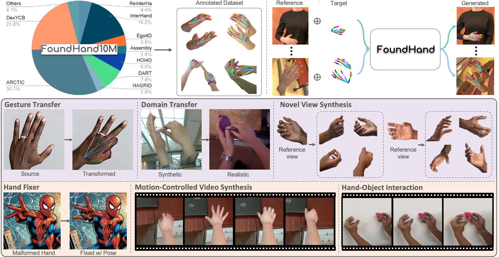

# :sparkles:[CVPR 2025 Highlight] FoundHand: Large-Scale Domain-Specific Learning for Controllable Hand Image Generation

[CVPR 2025] Official repository of "FoundHand: Large-Scale Domain-Specific Learning for Controllable Hand Image Generation".

[[Project Page]](https://ivl.cs.brown.edu/research/foundhand.html) [[Paper]](https://openaccess.thecvf.com/content/CVPR2025/papers/Chen_FoundHand_Large-Scale_Domain-Specific_Learning_for_Controllable_Hand_Image_Generation_CVPR_2025_paper.pdf) [[Hugging Face]](https://huggingface.co/spaces/Chaerin5/FoundHand)

<p> <strong>Authors</strong>:
    <a href="https://arthurchen0518.github.io/">Kefan Chen<sup>*</sup></a>
    ·
    <a href="https://chaerinmin.github.io/">Chaerin Min<sup>*</sup></a>   
    ·
	<a href="https://lg-zhang.github.io/">Linguang Zhang</a> 	 
    ·
	<a href="https://shreyashampali.github.io/">Shreyas Hampali</a>          
    ·
	<a href="https://scholar.google.co.uk/citations?user=9HoiYnYAAAAJ&hl=en">Cem Keskin</a> 
    ·
    <a href="https://cs.brown.edu/people/ssrinath/">Srinath Sridhar</a>
</p>



## FoundHand-10M Dataset

Download [FoundHand-10M](https://app.globus.org/file-manager?origin_id=4e4abc14-78e6-4575-8502-e54f204fc007&origin_path=%2F).
The dataset contains processed images and labels from [DexYCB](https://dex-ycb.github.io/),  [ARCTIC](https://github.com/zc-alexfan/arctic),  [ReInterHand](https://mks0601.github.io/ReInterHand/),  [InterHand2.6M](https://mks0601.github.io/InterHand2.6M/),  [Ego4D](https://ego4d-data.org/), [EpicKitchensVisor](https://epic-kitchens.github.io/VISOR/#downloads),  [AssemblyHands](https://assemblyhands.github.io/),  [HOI4D](https://hoi4d.github.io/), [RHD](https://lmb.informatik.uni-freiburg.de/resources/datasets/RenderedHandposeDataset.en.html), [RenderIH](https://github.com/adwardlee/RenderIH), [DART](https://dart2022.github.io/), [HAGRID](https://github.com/hukenovs/hagrid), and [WLASL](https://dxli94.github.io/WLASL/).

```
FoundHand10M/
├── Arctic/
    ├── processed/
        ├── test/							
        ├── train/							
        	├── s01-box_grab_01
        		├── 00010-6.jpg
        		├── 00010-6.npz
        		├── 00011-6.jpg
        		├── 00011-6.npz
        		├── ...
        	├── ...
├── AssemblyHands/
    ├── processed_seq/
        ├── val/							
        ├── train/				
        	├── nusar-2021_action_both_9012-c07c_9012_user_id_2021-02-01_164345/
        		├── 000520-C10095_rgb.jpg
        		├── 000520-C10095_rgb.npz
        		├── 000520-C10115_rgb.jpg
        		├── 000520-C10115_rgb.npz
        		├── ...
├── ...
```
Each data sample follows the naming convention of "<frame_id>-<camera_id>.jpg" (image) and "<frame_id>-<camera_id>.npz" (label), where frame_id and camera_id are associated with the same annotation as their original dataset. For non-multiview datasets, camera_id would all be the same, usually set as '0'. Each label file *.npz contains two fields:
```
'hand_mask': (512, 512) binary mask for hand segmentation.
'kpts': (42, 2) 2D hand keypoints following OpenPose convention, where [:21] indicates the right hand and [21:] indicates the left.
```


## Installation

1. Create a virtual environment and install necessary dependencies

```shell
conda create  -n foundhand python=3.9
conda activate foundhand
pip install torch==2.3.0 torchvision==0.18.0 torchaudio==2.3.0  --index-url https://download.pytorch.org/whl/cu121
pip install lightning==2.3.0
pip install timm==1.0.7 tqdm opencv-python scikit-image matplotlib tensorboard

git clone git@github.com:arthurchen0518/FoundHand.git
cd FoundHand
pip install -e
```

3. Download pretrained [FoundHand](https://drive.google.com/file/d/1AR08bpX5Ync7VykXq-S7ww8YIbRihVMD/view?usp=sharing), [SAM](https://dl.fbaipublicfiles.com/segment_anything/sam_vit_h_4b8939.pth), and [SD-VAE](https://huggingface.co/stabilityai/sd-vae-ft-mse-original/resolve/main/vae-ft-mse-840000-ema-pruned.ckpt) models and place them under `./weights/`.

## Demo
We encourage users to try our Hugging Face [demo](https://huggingface.co/spaces/Chaerin5/FoundHand) for a more accessible UI. We also provide Jupyter notebook demos to run.
```shell
./demos/FixHand.ipynb       # Fix malformed AI-generated hand.
./demos/Image2Image.ipynb   # Gesture transfer and domain transfer.
./demos/Image2Video.ipynb   # Video generation given the first frame and hand motion sequence.
./demos/NVS.ipynb	    # Novel view synthesis.
```

## Checklist

- [x] Release model weights and code.
- [x] Release demo notebooks.
- [x] Release FoundHand-10M data.
- [ ] Release inference code.
- [ ] Release training code.

## Acknowledgement

Part of this work was done during Kefan (Arthur) Chen’s internship at Meta Reality Lab. This work was additionally supported by NSF CAREER grant #2143576, NASA grant #80NSSC23M0075, and an Amazon Cloud Credits Award.

This codebase borrows from [DiT](https://github.com/facebookresearch/DiT).

## License

This dataset is licensed under the Creative Commons Attribution-NonCommercial 4.0 International License.

[](https://creativecommons.org/licenses/by-nc/4.0/)

To view a copy of this license, visit https://creativecommons.org/licenses/by-nc/4.0/.

## Citation


```
@InProceedings{Chen_2025_CVPR,
    author    = {Chen, Kefan and Min, Chaerin and Zhang, Linguang and Hampali, Shreyas and Keskin, Cem and Sridhar, Srinath},
    title     = {FoundHand: Large-Scale Domain-Specific Learning for Controllable Hand Image Generation},
    booktitle = {Proceedings of the Computer Vision and Pattern Recognition Conference (CVPR)},
    month     = {June},
    year      = {2025},
    pages     = {17448-17460}
}
```
